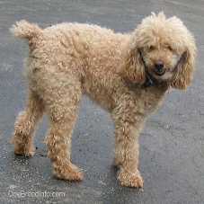
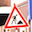

# AlexNet

AlexNet is a popular base network for transfer learning because its structure is relatively straightforward,
it's not too big, and it performs well empirically.

AlexNet puts the network on two GPUs, which allows for building a larger network. Although most of the calculations are done in parallel, the GPUs communicate with each other in certain layers. The original research paper on AlexNet said that parallelizing the network decreased the classification error rate by 1.7% when compared to a neural network that used half as many neurons on one GPU.

# Transfer Learning with TensorFlow

**Transfer learning** is the practice of starting with a network that has already been trained, and then applying that network to your own problem.

Because neural networks can often take days or even weeks to train, transfer learning (i.e. starting with a network that somebody else has already trained) can greatly shorten training time.

How do we apply transfer learning? Two popular methods are **feature extraction** and **finetuning**

- **Feature extraction**. Take a pretrained neural network and replace the final (classification) layer with a new classification layer, or perhaps even a small feedforward network that ends with a new classification layer. During training the weights in all the pre-trained layers are frozen, so only the weights for the new layer(s) are trained. In other words, the gradient doesn't flow backwards past the first new layer.
- **Finetuning**. This is similar to feature extraction except the pre-trained weights aren't frozen. The network is trained end-to-end.

Download the training data and AlexNet weights.
<a href="https://d17h27t6h515a5.cloudfront.net/topher/2016/October/580a829f_train/train.p" > training data </a>

# 1. AlexNet for inference on the image set it was trained on.

AlexNet was originally trained on the ImageNet database.
 
# 2. extract AlexNet's features and use them to classify images from the German Traffic Sign Recognition Benchmark dataset.

AlexNet expects a 227x227x3 pixel image, whereas the traffic sign images are 32x32x3 pixels.

In order to feed the traffic sign images into AlexNet, I resized the images to the dimensions that AlexNet expects.

# Feature Extraction
The problem is that AlexNet was trained on the ImageNet database, which has 1000 classes of images. You can see the classes in the caffe_classes.py file. None of those classes involves traffic signs.

In order to successfully classify our traffic sign images, I removed the final, 1000-neuron classification layer and replace it with a new, 43-neuron classification layer.

This is called feature extraction, because  basically I extracted the image features inferred by the penultimate layer, and passing these features to a new classification layer.

# Training the Feature Extractor

Training AlexNet (even just the final layer!) can take a little while, so if you don't have a GPU, running on a subset of the data is a good alternative. As a point of reference one epoch over the training set takes roughly 53-55 seconds with a GTX 970.
